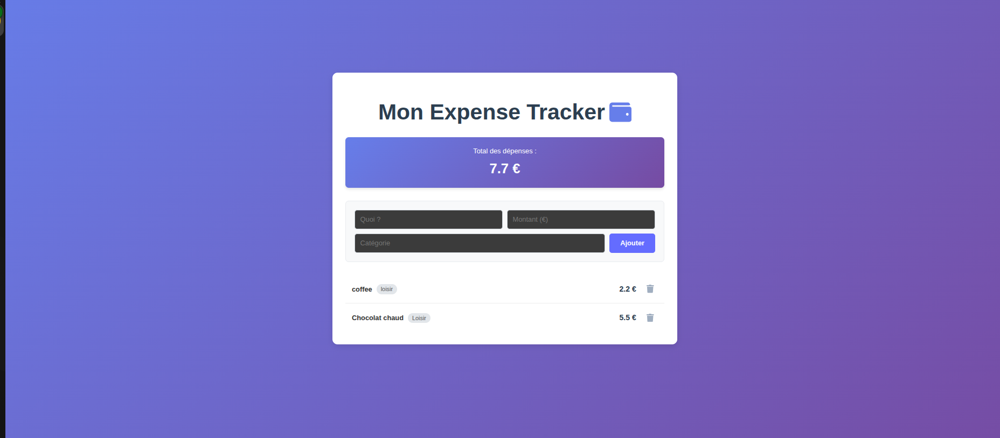

# 💸 Expense Tracker (Fully Dockerized)

A complete Fullstack application to manage personal expenses, built with **Python (FastAPI)** and **React**.
The entire project is containerized with **Docker**, meaning you don't need to install Python, Node.js, or PostgreSQL locally. Docker handles everything.



## 🌍 Live Demo

**🚀 Live Application:  :** https://expense-tracker-frontend-udlm.onrender.com

**📚 API Documentation :** https://expense-tracker-backend-f5eg.onrender.com/docs

> ⚠️ **Note :** The free backend instance spins down after 15 minutes of inactivity. The first request may take up to 30 seconds to wake up the server.


## 🚀 Features

* **Manage Expenses**: Add, Delete, and List expenses easily.
* **Real-time Updates**: Automatic calculation of the total amount.
* **Reactive UI**: Modern interface built with React & Vite.
* **Robust Backend**: REST API powered by FastAPI & SQLModel.
* **Data Persistence**: Data is safely stored in a PostgreSQL database.
* **Zero Config**: The whole stack (Frontend + Backend + DB) runs in isolated containers.

## 🛠️ Tech Stack

* **Frontend**: React, Vite, Sass (SCSS).
* **Backend**: Python, FastAPI.
* **Database**: PostgreSQL.
* **DevOps**: Docker & Docker Compose.

## 📦 How to Run

### 1. Prerequisites
Ensure you have **Git** and **Docker** (with Docker Compose) installed on your machine.

### 2. Installation
Clone the repository:
```bash
git clone [https://github.com/MargYre/PYHTON-expense-tracker.git](https://github.com/MargYre/PYHTON-expense-tracker.git)
cd PYHTON-expense-tracker
```

### 3. Launching the App 🐳
Navigate to the backend folder (where the Docker configuration resides) and start the containers:
```bash
cd backend
sudo docker-compose up --build
```
Docker will automatically build the images, install dependencies, and start the 3 services (Database, Backend API, and Frontend).

### 4. Accessing the App
Navigate to the backend folder (where the Docker configuration resides) and start the containers:
```bash
Once the terminal says Vite ... ready, you can access:

Frontend (App Interface): http://localhost:5173

Backend (API Docs): http://localhost:8000/docs

Database: Port 5432
```

### 🛑 Stopping the App
To stop the containers press Ctrl + C in the terminal, or run:
```bash
sudo docker-compose down
```